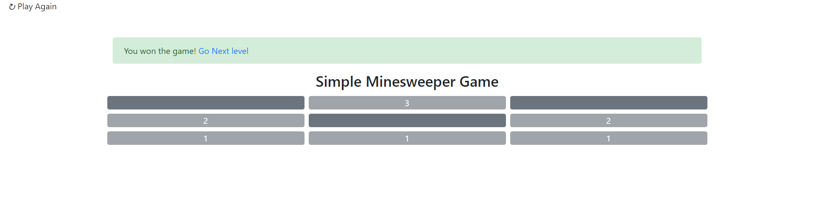
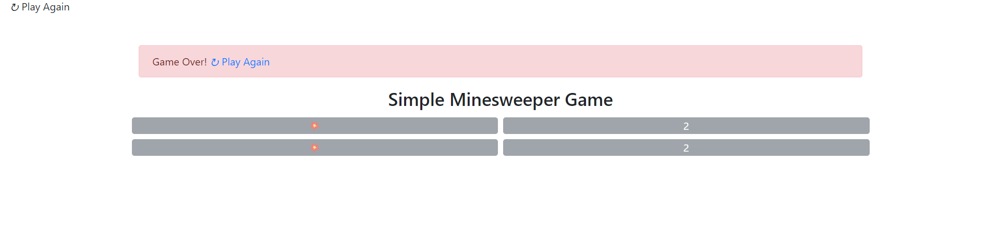

# MinesweeperGame
 Summary of MinesweeperGame
 *  we set the position on Mines randomly
 *  Then add 1 to all neighbors of call 
 # Teleologies 
- Initially, I developed this game exclusively for the backend and rendered it on the command line, Later, I decided to add a user interface (UI). I
 -  However, since I originally built the game's logic in PHP on the backend before considering the UI, I continued using PHP to handle the game's mechanics.
 - For the UI, I used HTML formatted with PHP, while JavaScript handled the game's interactions.

 ## How it work 
 - The game start with level 1 (2 x 2 matrix) 
  
  - if user pass the current level then can go to next level
  
  - In case the user failed to find all mines correctly the user can reload the game
  
  